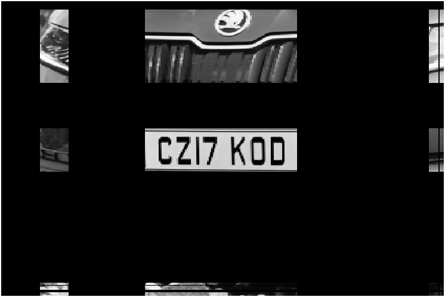
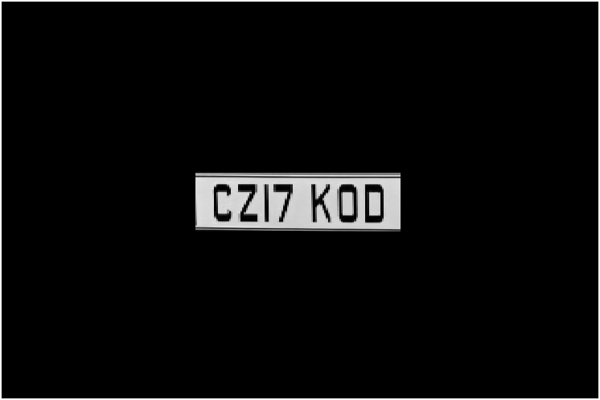

# Automatic Number Plate Recognition (ANPR) using MATLAB

This project implements an Automatic Number Plate Recognition (ANPR) system using MATLAB. The goal is to detect and recognize vehicle license plates from images using image processing techniques.

## 🚗 Overview

ANPR is a computer vision application that uses image processing to extract vehicle number plates from images and recognize the characters on them. This MATLAB-based system performs the following steps:
1. Image acquisition
2. Preprocessing (grayscale conversion, noise removal)
3. License plate detection
4. Character segmentation
5. Character recognition using template matching

## 🛠️ Technologies Used

- **MATLAB** (R2021a or later recommended)
- Image Processing Toolbox

## 📂 Project Structure

ANPR/
├── images/                  # Input vehicle images
├── results/                 # Output images with detected plates
├── ANPR_Main.m             # Main MATLAB script
└── README.md               # Project documentation


## ▶️ How to Run

1. Clone the repository:

   ```bash
   git clone https://github.com/yourusername/ANPR_MATLAB.git

2. Open MATLAB and set the project folder as the current directory.

3. Run the main.m script.

4. Select a vehicle image when prompted.

5. The system will display the detected license plate and recognized characters.

📸 Sample Output :

Input Image  → Detected Plate→ Recognized Number

✅ Features :

Works on clear daylight vehicle images

Template-based character recognition

Modular and easy-to-modify code

🚧 Limitations :

Accuracy depends on image quality

Not robust under poor lighting or blurred images

No support for real-time video (can be extended)

📌 Future Enhancements :

Integrate with real-time video using webcam

Train a machine learning model for better character recognition

Improve plate localization using deep learning (YOLO or CNN)

📄 License :

This project is open-source and available under the MIT License.

🙋‍♂️ Author

Mathiyalagan

Electronics and Communication Engineering Student

GitHub: Mathiyalagann
